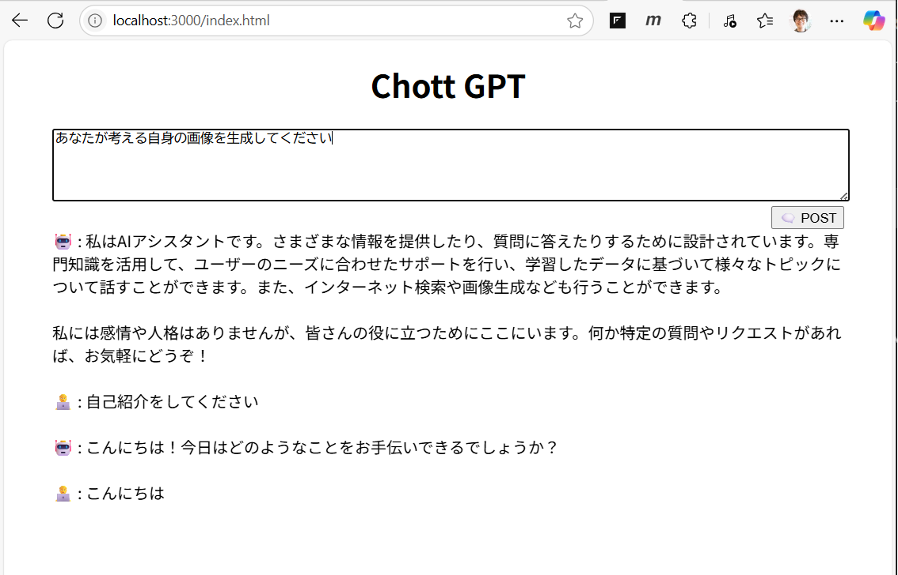

# basic-gpt-chatbot
ハンズオンの演習に使用する gpt モデルを使用するシンプルなチャットボット アプリケーションです。

このアプリケーションは [Azure OpenAI サービスを使用したアプリケーション開発 ハンズオン](https://github.com/osamum/AOAI-first-step-for-Developer) の演習で作成するアプリケーションに UI を追加し、若干の変更を加えたものです。



## 機能

このチャットボット アプリケーションは Azure OpenAI サービスの言語モデル、埋め込みモデル、画像生成モデルを使用して、以下の機能を提供します。

### 基本
- **会話**: ユーザーはテキストを入力し、GPT モデルが応答を生成します。画像の有効な URL を会話に含めることで画像も認識します。
- **埋め込み**: 設定で RAG が有効になっている場合、検索の処理の際にユーザーの問い合わせをベクトル化します。
- **画像生成**: ユーザーはテキストプロンプトを入力し、DALL-E モデルが画像を生成します。

### オプション

- **RAG (Retrieval-Augmented Generation)**: 既存の Azure AI Search インスタンスへ接続情報とイデックス名、ベクトル データのフィールド名を指定することで、RAG 機能を有効にできます。これにより、ユーザーの問い合わせに対して関連するドキュメントを検索し、応答を生成する際に利用します。

- **インターネットからの情報検索**: ファイル AOAI/webSearch.js 内のコメントに従い、任意の Web 検索 API を使用して関数を実装することで、インターネットからの情報検索機能を有効にできます。

## セットアップ方法

開発環境でこのアプリケーションを動作させるには、以下の手順に従ってください。

### Azure リソースのデプロイ

アプリケーションが動作するのに必要な Azure リソースをデプロイします。

手動でのデプロイを行う場合は以下のドキュメントの内容に従い作業してください。


1. [Azure ポータルから Open AI リソースを作成する](https://github.com/osamum/AOAI-first-step-for-Developer/blob/main/Ex01-1.md)
2. [言語モデル gpt-4o-mini のデプロイ](https://github.com/osamum/AOAI-first-step-for-Developer)
3. [埋め込みモデル : text-embedding-ada-002 のデプロイ](https://github.com/osamum/AOAI-first-step-for-Developer/blob/main/Ex01-3.md)
4. [画像生成モデル : dall-e-3 のデプロイ](https://github.com/osamum/AOAI-first-step-for-Developer/blob/main/Ex01-4.md)

    RAG 用に Azure AI Search インスタンスを新規に作成し、データを追加してベクトル インデックスを作成する場合は、以下のドキュメントの内容に従い作業してください。

    [演習 2. 3 :独自データの追加](https://github.com/osamum/AOAI-first-step-for-Developer/blob/main/Ex02-3.md)

Bicep テンプレートを使用して Azure リソースをほぼ自動でデプロイすることもできます。

具体的な方法については、以下のドキュメントの内容に従い作業してください。

* [準備 1 : Azure リソースの作成](https://github.com/osamum/aoai-app-basic-hosting/blob/main/prep01.md)


### ランタイムのセットアップ

このアプリケーションは Node.js で動作します。以下から Node.js のランタイムを入手してインストールしてください。

- [Node.js 公式サイト](https://nodejs.org/)

### 環境変数の設定

このリポジトリをクローンし、[Visual Studio Code](https://code.visualstudio.com/download) などのエディターで開き、プロジェクトのルート ディレクトリにある `example.env` ファイルをコピーして `.env` ファイルを作成します。

`.env` ファイルの内容を以下を参考に設定します(※)。

(※ほとんどの場合、Azure OpeAI Service リソースのエンドポイントの URL と API キーを設定し、他は既定の設定のままで動作します。)

```env
#Azure OpeAI Service リソースの接続情報
AZURE_OPENAI_ENDPOINT=　Azure OpeAI Service リソースのエンドポイント URL
AZURE_OPENAI_API_KEY=　Azure OpeAI Service リソースの API キー

#言語モデルの設定
LM_SETTINGS={"deploymentName":"言語モデルのデプロイ名", "apiVersion":"API のバージョン", "conversationLength":"会話を保持する件数", "tokenLimit":"トークンの上限"}

#埋め込みモデルの設定
EMBEDDING_SETTINGS={"deployName":"埋め込みモデルのデプロイ名", "apiVersion":"API のバージョン"}

#画像生成モデルの設定
IMAGE_GENERATOR_SETTINGS={"deploymentName":"画像生成モデルのデプロイ名", "apiVersion":"API のバージョン", "imageSize":"画像のサイズ","imageStyle":"vivid"}

#埋め込みモデルのエンドポイントのサブドメインが言語モデルのものと異なる場合にのみ個別に設定
EMBEDDING_ENDPOINT=
EMBEDDING_API_KEY=

#画像生成モデルのエンドポイントのサブドメインが言語モデルのものと異なる場合にのみ個別に設定
IMAGE_GENERATOR_ENDPOINT=
IMAGE_GENERATOR_API_KEY=

#Azure AI Search Service リソースの接続情報 (この情報を設定するとRAG機能が有効になります)
SEARCH_ENDPOINT= Azure AI Search Service リソースのエンドポイント URL
SEARCH_API_KEY= Azure AI Search Service リソースの管理者キー
SEARCH_SETTINGS=={"indexName":"インデックス名","fieldName":"ベクトルデータ フィールド名","thresholdScore":"5.8"}

#Web API 検索の設定 (Web 検索を有効にするにはこの設定と以下の作業が必要です:
#1. AOAI/webSearch.js の webSerch 関数の記述をコメントに従い追記
#2. AOAI/lm.js の messages[] の system メッセージをコメントに従い変更
WEB_SEARCH_ENDPOINT=
WEB_SEARCH_KEY=
```

### 依存関係のインストール

ターミナル画面でプロジェクトのルート ディレクトリを開き、以下のコマンドを実行して必要な依存関係をインストールします。

```bash
npm install
```

### アプリケーションの起動

以下のコマンドを実行してアプリケーションを起動します。

```bash
npm start
```

アプリケーションが起動すると、ターミナルに表示される URL (通常は `http://localhost:3000`) をブラウザで開くことでチャットボット アプリケーションを利用できます。

これ以降の作業については各ハンズオンの内容に従ってください。

